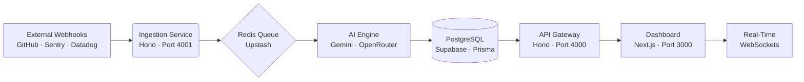

<div align="center">
  
  <br/>
  <h1>⚡ OPSCORD ⚡</h1>
  <p><b>Stop Firefighting. Start Understanding.</b></p>
  <p>The AI-powered observability and incident intelligence platform for modern engineering teams.</p>
  <br />

  <p>
    <a href="https://github.com/probably-ABHINAV/OPSCORD/actions"></a>
    <a href="https://github.com/probably-ABHINAV/OPSCORD/blob/main/LICENSE"></a>
    <a href="https://gssoc.girlscript.tech/"></a>
    <a href="https://github.com/probably-ABHINAV/OPSCORD/pulls"></a>
    <a href="https://discord.gg/npr2H4RdB"></a>
  </p>
</div>

---

## 🎯 Product Positioning

**The Problem:** When an outage occurs, your team is hit with an _alert storm_. Datadog screams about latency, Kubernetes restarts pods, and GitHub shows a recent merge. You spend 45 minutes manually cross-referencing dashboards to figure out _why_ the system broke.

**The Solution:** **OPSCORD** acts as an intelligent webhook aggregator and causality engine. It ingests events from all your tools, feeds them into an AI engine, and gives you a single dashboard that tells you exactly what broke, why it broke, and how to fix it.

> _"The latency spike in Datadog was 98% likely caused by PR #284 merging 3 minutes ago."_

## 🏗️ Architecture



## 🛠️ Tech Stack

| Domain         | Technologies                                                                   |
| :------------- | :----------------------------------------------------------------------------- |
| **Frontend**   | Next.js 14 (App Router), React, Tailwind CSS, Framer Motion, Recharts, Zustand |
| **Backend**    | Hono.js (API Gateway + Ingestion), Prisma ORM                                  |
| **Database**   | PostgreSQL (Supabase), Redis (Upstash)                                         |
| **AI**         | Google Gemini, OpenRouter                                                      |
| **Auth**       | Clerk                                                                          |
| **DevOps**     | Turborepo, Docker, GitHub Actions, Vercel                                      |
| **Testing**    | Vitest, Husky, lint-staged, Prettier                                           |
| **Monitoring** | Sentry, PostHog                                                                |

## ✨ Core Features

- 🔌 **Universal Event Ingestion** — Accept webhooks from GitHub, Sentry, Datadog, Kubernetes, and custom sources
- 🧠 **AI Causality Engine** — LLM-powered root cause analysis across sequential event chains
- ⚡ **Real-Time Command Center** — WebSocket-powered dashboard with live infrastructure state
- 📊 **Metrics Visualization** — KPI cards, latency graphs, error rate trends via Recharts
- 🔔 **Alert Timeline** — Git-commit-style visualization for temporal event correlation
- 🛡️ **Infrastructure Intelligence** — Service health grid with resource utilization monitoring

---

## 🚀 Getting Started

### Prerequisites

- Node.js 20+ (`nvm use` if you have `.nvmrc`)
- Docker Desktop (for local Postgres + Redis)

### Setup

```bash
# 1. Clone
git clone https://github.com/probably-ABHINAV/OPSCORD.git
cd OPSCORD

# 2. Install
npm install

# 3. Environment
cp .env.example .env

# 4. Start infrastructure
docker compose up -d

# 5. Database
npx prisma db push --schema=packages/db/prisma/schema.prisma

# 6. Dev server
npm run dev
```

| Service     | URL                     |
| ----------- | ----------------------- |
| Dashboard   | `http://localhost:3000` |
| API Gateway | `http://localhost:4000` |
| Ingestion   | `http://localhost:4001` |

### Available Commands

```bash
npm run dev           # Start all services
npm run build         # Build all workspaces
npm run test          # Run all tests
npm run test:watch    # Tests in watch mode
npm run test:coverage # Tests with coverage
npm run lint          # Lint all workspaces
npm run type-check    # TypeScript check
npm run format        # Auto-format with Prettier
npm run validate      # Full quality gate (lint + type-check + test)
```

---

## 🤝 Contributing

We're proudly participating in **GirlScript Summer of Code (GSSoC) 2026** 🎉

### Quick Start for Contributors

1. Read [CONTRIBUTING.md](./CONTRIBUTING.md) — Rules, branch naming, commit format
2. Browse issues labeled [`good first issue`](https://github.com/probably-ABHINAV/OPSCORD/labels/good%20first%20issue) or [`gssoc`](https://github.com/probably-ABHINAV/OPSCORD/labels/gssoc)
3. Comment on an issue to get assigned
4. Fork → Branch → Code → `npm run validate` → PR

See [GSSOC_ISSUES.md](./GSSOC_ISSUES.md) for 42 pre-scoped issues across all difficulty levels.

### Contributor Tracks

| Track               | Focus                          |
| ------------------- | ------------------------------ |
| 🔵 `track:frontend` | React, Next.js, Tailwind, UI   |
| 🟢 `track:backend`  | Hono, API, Prisma, DB          |
| 🟣 `track:devops`   | CI/CD, Docker, GitHub Actions  |
| 🟡 `track:ai`       | Gemini, anomaly detection, NLP |
| 🔵 `track:docs`     | Documentation, guides          |
| 🔴 `track:security` | Auth, rate limiting, headers   |

---

## 🗺️ Roadmap

### Q2 2026 — Foundation

- [x] Monorepo architecture (Turborepo)
- [x] Dashboard UI (Incidents, Metrics, Infrastructure)
- [x] CI/CD pipelines (GitHub Actions — 5 quality gates)
- [x] Testing infrastructure (Vitest, 9 tests)
- [x] Pre-commit hooks (Husky + lint-staged)
- [x] Docker multi-stage builds
- [ ] Clerk authentication integration
- [ ] Real-time WebSocket events

### Q3 2026 — Intelligence

- [ ] AI incident summarization (Gemini)
- [ ] Anomaly detection engine
- [ ] GitHub/Sentry/Datadog webhook parsers
- [ ] Redis event queue (BullMQ)
- [ ] Command palette (Cmd+K)

### Q4 2026 — Scale

- [ ] Custom dashboard widgets
- [ ] Multi-org RBAC
- [ ] Slack/Discord notifications
- [ ] Public API with rate limiting
- [ ] Playwright E2E tests

---

## 👑 Maintainers

- **Abhinav** — _Creator & Lead Maintainer_ — [@probably-ABHINAV](https://github.com/probably-ABHINAV)

## ✨ Contributors

Thanks to these amazing people! ([emoji key](https://allcontributors.org/docs/en/emoji-key))

<!-- ALL-CONTRIBUTORS-LIST:START -->
<!-- prettier-ignore-start -->
<!-- markdownlint-disable -->
<table>
  <tbody>
    <tr>
      <td align="center" valign="top" width="14.28%"><a href="https://github.com/probably-ABHINAV"><br /><sub><b>Abhinav</b></sub></a><br />💻 📖 🚇 🚧 📆</td>
    </tr>
  </tbody>
</table>
<!-- markdownlint-restore -->
<!-- prettier-ignore-end -->
<!-- ALL-CONTRIBUTORS-LIST:END -->

This project follows the [all-contributors](https://allcontributors.org) specification. Contributions of any kind welcome!

## 🌐 Community

- **Discord:** [Join the OPSCORD Server](https://discord.gg/npr2H4RdB)
- **Twitter/X:** [@opscord_ai](https://twitter.com/opscord_ai)
- **Discussions:** [GitHub Discussions](https://github.com/probably-ABHINAV/OPSCORD/discussions)

Please read our [CODE_OF_CONDUCT.md](./CODE_OF_CONDUCT.md) for community rules.

---

<div align="center">
  <i>Built with ⚡ by the OPSCORD Community.</i>
</div>
