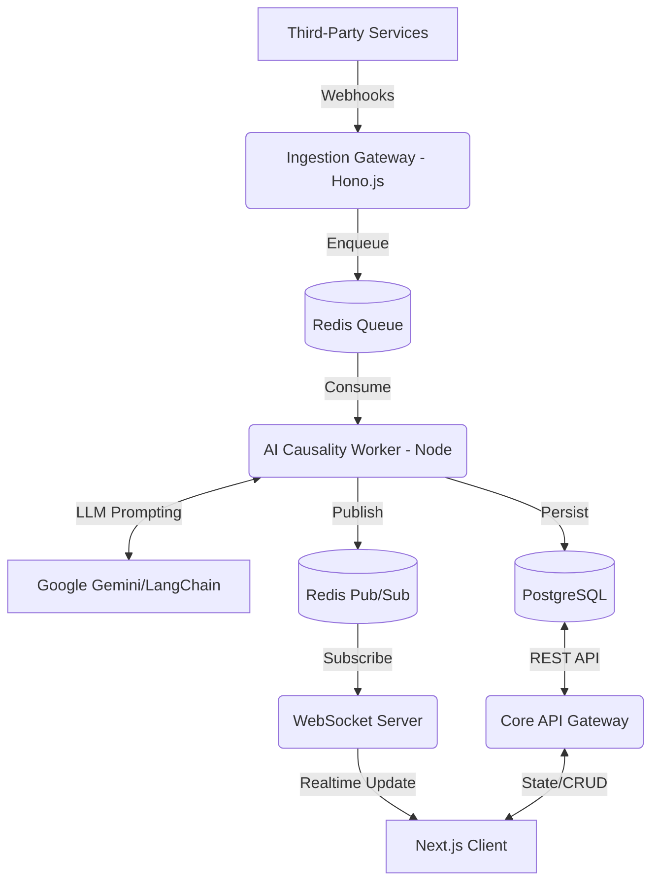

# OPSCORD System Design

OPSCORD acts as an intelligent webhook aggregator and causality engine. It uses a modern monorepo setup targeting cloud-native environments like Vercel and AWS/Render.

## Architecture Diagram

## Core Components

### 1. Ingestion Gateway (`apps/ingestion`)

Optimized for ultra-low latency and high availability. It immediately returns `202 Accepted` after validating the incoming webhook's payload signature (e.g. from GitHub or Datadog) and enqueues the payload to Redis.

### 2. Event Queue (`Redis`)

Decouples ingestion from processing to handle sudden alert storms (e.g., cascading microservice failures triggering thousands of Datadog monitors simultaneously).

### 3. AI Causality Worker (`apps/ai-worker`)

A persistent Node.js worker consuming events from Redis. It groups incoming events within a time window by Project ID, constructs a LangChain prompt containing the sequence of events, and queries the Gemini LLM to deduce the root cause.

- Resulting "Incidents" and "Events" are persisted to PostgreSQL.
- Broadcasts the new event to the Redis Pub/Sub channel for that Project ID.

### 4. Real-time Service (`apps/ws`)

A Node.js/Socket.io server that acts as a WebSocket gateway. Clients subscribe to their active Project ID. The server listens to Redis Pub/Sub and streams live events to the frontend without requiring browser polling.

### 5. Next.js Frontend (`apps/web`)

The unified Command Center dashboard. React Server Components handle initial static/SSR rendering of historical incidents, while Client Components establish the WebSocket connection to merge live data into the state.

## Caching Strategy

- **Configuration Data:** Alert Rules and Organization details are cached in Redis to prevent constant DB hits during ingestion validation.
- **Context Windows:** The AI worker caches the last 15 minutes of events in Redis to quickly assemble prompts without heavy Postgres queries.
